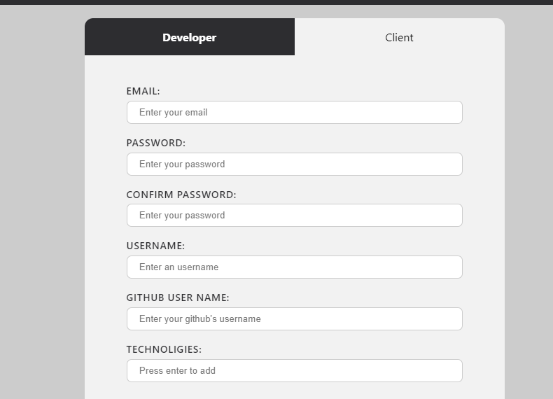
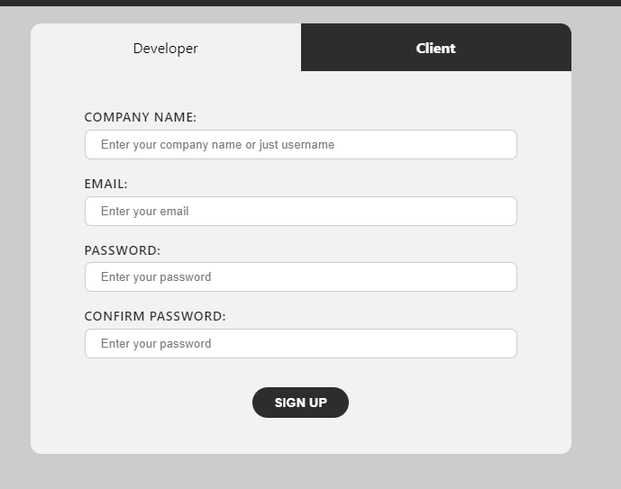
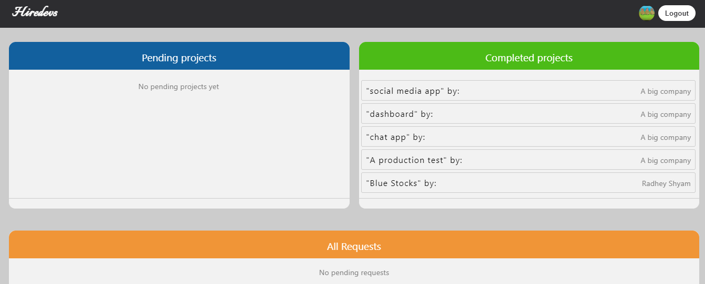
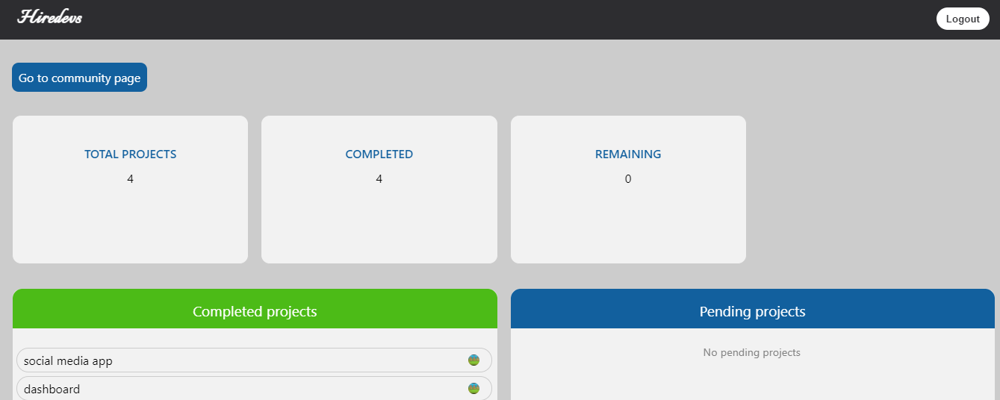
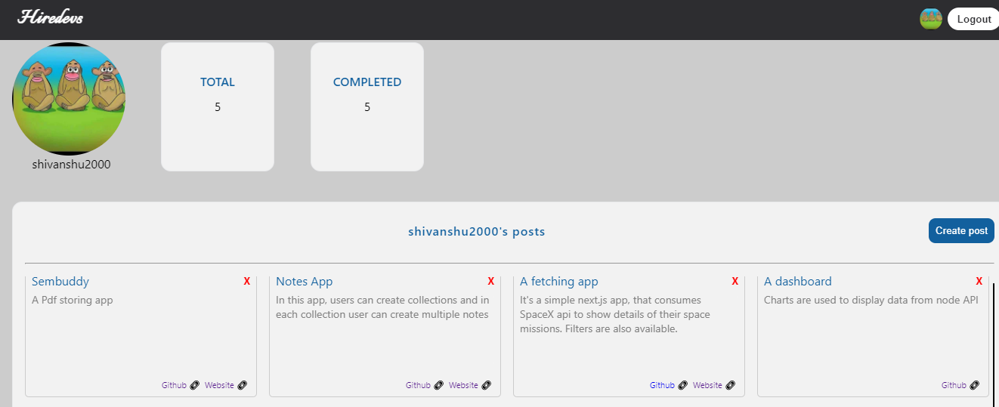
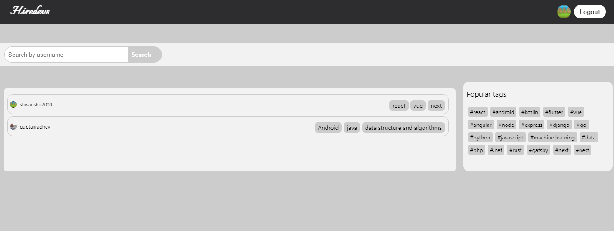

# Hiredevs

## Overview

While registering, user will have two options of either signing up as a developer or client. If client, users can hire users registered as developers by sending requests for their projects providing details of the project.

## Features

- registration with email verification
- community page to find developers by username and technologies
- email messages whenever there is a change in status of a particular project

## User specific features

Client

- dashboard to track all projects as per status
- send request --> claim project when completed

Developer

- dasboard to track all projects as per status
- profile which all clients and other developers can see
- create posts about the projects done previously
- accept client requests --> request for approval when completed

## API

Api is created with Node.js and Express.js [Api repo](https://github.com/shivanshu2000/hiredevs-api)

## Screenshots

  
  

    
    
 

    
    

